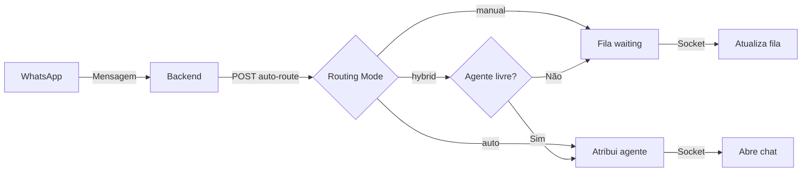
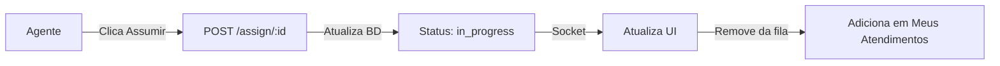
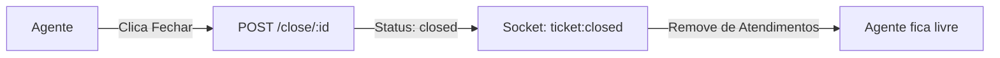

# Sistema de Roteamento de Tickets

## Visão Geral

O sistema de tickets implementa roteamento híbrido para atendimentos WhatsApp, com suporte aos modos **Manual**, **Automático** e **Híbrido**.

## Modos de Roteamento

### Manual
- Todos os tickets novos vão para a **Fila de Espera**
- Agentes devem clicar em "Assumir" para iniciar atendimento
- Ideal para equipes que precisam revisar tickets antes de atender

### Automático
- Tickets são distribuídos automaticamente para agentes disponíveis
- Usa algoritmo **round-robin** (agente menos ocupado)
- Chat abre automaticamente para o agente atribuído
- Não há fila de espera visível

### Híbrido
- Se houver agente livre → atribui automaticamente
- Se não houver → ticket vai para fila de espera
- Melhor dos dois mundos: eficiência + controle

## Arquitetura

### Backend (Bridge)

**Endpoints REST:**
```
GET  /api/tickets/waiting?companyId={uuid}
POST /api/tickets/assign/:ticketId
POST /api/tickets/auto-route
POST /api/tickets/close/:ticketId
```

**Eventos Socket.IO:**
- `ticket:new` - Novo ticket criado
- `ticket:assigned` - Ticket atribuído a agente
- `ticket:waiting` - Ticket na fila de espera
- `ticket:closed` - Ticket finalizado

**Serviços:**
- `ticketRouter.ts` - Lógica de roteamento
- `supabaseClient.ts` - Cliente Supabase

### Frontend (React)

**Store Zustand:**
- `useTicketsStore` - Gerencia estado de tickets
- Separação: `waitingTickets`, `myTickets`, `activeTicketId`

**Hooks:**
- `useTicketSocket` - Integração Socket.IO realtime
- Auto-abre chat no modo automático

**Componentes:**
- `TicketQueue` - Fila de espera
- `MyTickets` - Atendimentos ativos do agente

## Fluxo de Dados

### Criação de Ticket



### Atribuição Manual



### Finalização



## Banco de Dados

### Tabela: companies
```sql
id UUID PRIMARY KEY
name TEXT
routing_mode ENUM(manual, auto, hybrid) DEFAULT manual
```

### Tabela: users
```sql
id UUID PRIMARY KEY
company_id UUID REFERENCES companies
role ENUM(admin, agent)
status ENUM(active, inactive)
```

### Tabela: tickets
```sql
id UUID PRIMARY KEY
company_id UUID REFERENCES companies
customer_number TEXT
last_message TEXT
status ENUM(waiting, in_progress, closed)
assigned_to UUID REFERENCES users (nullable)
created_at TIMESTAMP
updated_at TIMESTAMP
```

## Segurança

### RLS Policies
- Usuários só veem tickets da sua empresa
- Agentes podem atualizar tickets atribuídos a eles
- Admins podem gerenciar todos os tickets da empresa

### Funções Security Definer
- `get_user_role(user_id)` - Retorna role do usuário
- `get_user_company(user_id)` - Retorna company_id do usuário

## Configuração

### Variáveis de Ambiente (Bridge)

```env
# Backend
PORT=3001
PANEL_URL=http://localhost:5173

# Supabase
SUPABASE_URL=https://kfsvpbujmetlendgwnrs.supabase.co
SUPABASE_KEY=your-anon-key
```

### Variáveis de Ambiente (Frontend)

```env
# API
VITE_API_BASE_URL=http://localhost:3001/api
VITE_SOCKET_URL=http://localhost:3001
```

## Uso

### 1. Configurar Empresa

```typescript
const company = {
  id: "company-123",
  name: "Minha Empresa",
  routing_mode: "hybrid", // manual, auto, hybrid
};
```

### 2. Conectar Socket.IO

```typescript
import { useTicketSocket } from "@/hooks/useTicketSocket";

// Na página de tickets
useTicketSocket(companyId, {
  onTicketAssigned: (ticket, agentId) => {
    console.log("Ticket atribuído:", ticket);
  },
  onTicketWaiting: (ticket) => {
    console.log("Ticket na fila:", ticket);
  },
});
```

### 3. Assumir Atendimento

```typescript
import { assignTicket } from "@/api/tickets";

const handleAssign = async (ticketId: string) => {
  const ticket = await assignTicket(ticketId, currentUserId);
  // Socket emite evento automaticamente
};
```

### 4. Finalizar Atendimento

```typescript
import { closeTicket } from "@/api/tickets";

const handleClose = async (ticketId: string) => {
  await closeTicket(ticketId);
  // Agente fica disponível novamente
};
```

## Monitoramento

### Logs Backend

```bash
# Ver logs em tempo real
cd bridge
npm run dev
```

Logs incluem:
- `🎫 New ticket` - Novo ticket criado
- `✅ Ticket assigned` - Ticket atribuído
- `⏳ Ticket waiting` - Ticket na fila
- `🔒 Ticket closed` - Ticket fechado

### Eventos Socket.IO

No frontend, os eventos são logados no console:
```typescript
console.log("🎫 New ticket:", data.ticket);
console.log("✅ Ticket assigned:", data.ticket);
```

## Troubleshooting

### Ticket não aparece na fila
- Verifique o `routing_mode` da empresa
- Confirme conexão Socket.IO ativa
- Check logs do backend

### Atribuição automática não funciona
- Verifique se há agentes com `status: active`
- Confirme que `role: agent` está correto
- Revise logs do algoritmo round-robin

### Socket.IO desconectado
- Confirme `VITE_SOCKET_URL` no frontend
- Verifique se o backend está rodando
- Check CORS no backend (deve permitir origin do frontend)

## Próximos Passos

- [ ] Adicionar suporte a múltiplas empresas por usuário
- [ ] Implementar métricas de atendimento (tempo médio, etc)
- [ ] Criar painel de administração para gerenciar routing_mode
- [ ] Adicionar notificações push quando ticket for atribuído
- [ ] Implementar fila prioritária (VIP, urgente, etc)
