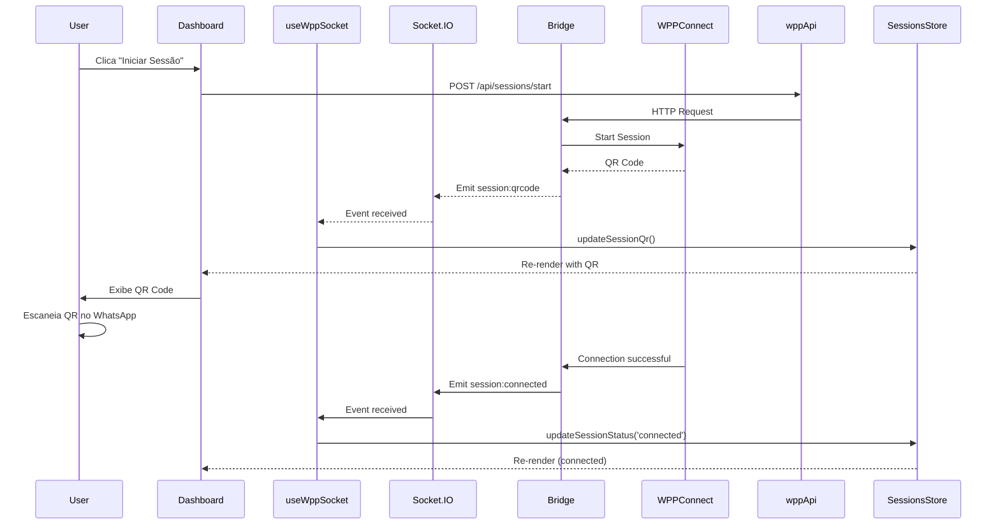

# WPPConnect Console - Frontend

Painel React + TypeScript + Vite para gerenciar sessões WPPConnect via Socket.IO.

## 🏗️ Arquitetura

```
src/
├── api/               # Clientes HTTP (Axios)
│   └── wppconnect.ts  # API REST do bridge server
├── components/        # Componentes React
│   ├── layout/        # Layout (Header, Sidebar, Protected)
│   ├── messages/      # Componentes de mensagens
│   └── ui/            # shadcn/ui components
├── hooks/             # React hooks customizados
│   ├── useWppSocket.ts    # Hook Socket.IO + WPPConnect
│   └── use-toast.ts       # Toast notifications
├── lib/               # Utilitários e configurações
│   ├── axios.ts       # Cliente Axios configurado
│   ├── socket.ts      # Cliente Socket.IO
│   └── utils.ts       # Helpers gerais
├── pages/             # Páginas/rotas
│   ├── Dashboard.tsx  # Status e QR Code
│   ├── Messages.tsx   # Chat e envio de mensagens
│   ├── Contacts.tsx   # Contatos
│   └── Login.tsx      # Autenticação
├── store/             # Zustand state management
│   ├── auth.ts        # Estado de autenticação
│   └── sessions.ts    # Estado de sessões WPP
└── types/             # TypeScript types
    └── index.ts
```

## 🔌 Integração Socket.IO

### Hook `useWppSocket`

O hook gerencia automaticamente:
- Conexão/desconexão do socket
- Subscrição a eventos de sessão
- Integração com Zustand store
- Toast notifications

**Uso:**

```tsx
import { useWppSocket } from '@/hooks/useWppSocket';

function MyComponent() {
  const { sessionId } = useWppSocket({
    sessionId: 'default',
    autoConnect: true
  });
  
  // O socket conecta automaticamente e escuta eventos
}
```

### Eventos Recebidos

| Evento | Payload | Descrição |
|--------|---------|-----------|
| `session:status` | `{ connected, message, qrCode? }` | Status da sessão |
| `session:qrcode` | `{ session, qrCode }` | Novo QR code disponível |
| `session:connected` | `{ session }` | Sessão conectada |
| `session:error` | `{ error }` | Erro na sessão |
| `message:received` | `{ session, message }` | Nova mensagem recebida |

### Eventos Enviados

| Evento | Payload | Descrição |
|--------|---------|-----------|
| `subscribe:session` | `sessionId` | Inscrever-se em uma sessão |
| `unsubscribe:session` | `sessionId` | Desinscrever-se |

## 🗄️ Zustand Store

### Sessions Store (`store/sessions.ts`)

Armazena estado de todas as sessões WPP:

```typescript
interface Session {
  status: 'disconnected' | 'connecting' | 'connected' | 'qr-ready';
  qr?: string;
  messages: Message[];
  lastUpdate: number;
}

const useSessionsStore = create<SessionsState>((set) => ({
  sessions: {},
  activeSession: null,
  
  // Actions
  setActiveSession: (sessionId) => { ... },
  updateSessionStatus: (sessionId, status) => { ... },
  updateSessionQr: (sessionId, qr) => { ... },
  addMessage: (sessionId, message) => { ... },
  clearSession: (sessionId) => { ... },
}));
```

**Uso em componentes:**

```tsx
import { useSessionsStore } from '@/store/sessions';

function MyComponent() {
  const session = useSessionsStore((state) => state.sessions['default']);
  const addMessage = useSessionsStore((state) => state.addMessage);
  
  // session.status, session.qr, session.messages
}
```

### Auth Store (`store/auth.ts`)

Gerencia autenticação local (sessionStorage):

```typescript
const useAuthStore = create<AuthState>((set) => ({
  user: null,
  isAuthenticated: false,
  
  login: (username, password) => { ... },
  logout: () => { ... },
}));
```

## 🔗 Conectando ao Bridge Server

### 1. Configure as variáveis de ambiente

Edite `.env`:

```env
VITE_API_BASE_URL=http://localhost:3001/api
VITE_SOCKET_URL=http://localhost:3001
VITE_APP_NAME=WPPConnect Console
```

### 2. Inicie o bridge server

```bash
cd bridge
npm install
npm run dev
```

### 3. Configure o token de autenticação

No bridge server (`.env`):
```env
PANEL_TOKEN=meu-token-seguro
```

No painel, o token é enviado automaticamente via Axios interceptor (lido do sessionStorage).

### 4. Inicie o painel

```bash
npm run dev
```

## 🚀 Fluxo de Conexão



## 📱 Páginas

### Dashboard (`/dashboard`)

- Exibe status da conexão
- Mostra QR code para autenticação
- Botão para iniciar sessão
- Atualização em tempo real via Socket.IO

### Messages (`/messages`)

- Lista de mensagens recebidas
- Formulário para enviar mensagens
- Atualização em tempo real via Socket.IO
- Mensagens armazenadas no Zustand

### Contacts (`/contacts`)

- Lista de contatos
- Busca e filtros
- (Em desenvolvimento)

### Login (`/`)

- Autenticação local (sessionStorage)
- Redirecionamento para dashboard após login

## 🎨 Temas

O painel usa `next-themes` para dark/light mode:

```tsx
import { useTheme } from '@/components/theme-provider';

function MyComponent() {
  const { theme, setTheme } = useTheme();
  
  return (
    <button onClick={() => setTheme(theme === 'dark' ? 'light' : 'dark')}>
      Toggle Theme
    </button>
  );
}
```

Cores configuradas em `src/index.css` com tokens CSS:

```css
:root {
  --primary: 142 76% 55%;     /* Verde-lima #22C55E */
  --secondary: 237 61% 60%;    /* Violeta #6366F1 */
  --background: 220 14% 6%;    /* Fundo #0E0E11 */
}
```

## 🔐 Segurança

- Token Bearer enviado em todos os requests REST
- Socket.IO conecta automaticamente (sem auth no exemplo)
- RLS/Auth podem ser adicionados no bridge server
- sessionStorage limpo ao fazer logout

## 🐛 Debug

### Logs do Socket.IO

Todos os eventos são logados no console:

```
✅ Socket connected: abc123
📊 Session status: { connected: false }
📱 QR Code received
💬 Message received: { from: '555...', body: 'Hello' }
```

### Zustand DevTools

Use a extensão Redux DevTools para ver o estado:

```tsx
import { devtools } from 'zustand/middleware';

const useStore = create(devtools((set) => ({ ... })));
```

### Network Inspector

Verifique requests REST no DevTools:
- Headers → Authorization: Bearer token
- Response → JSON com dados

## 📦 Dependências Principais

- **React** 18.3.1
- **TypeScript** 5.3
- **Vite** 5.x
- **React Router** 6.30
- **Zustand** 5.0
- **Axios** 1.12
- **Socket.IO Client** 4.8
- **shadcn/ui** (Radix UI)
- **Tailwind CSS** 3.x
- **next-themes** 0.3

## 🔄 Ciclo de Vida do Socket

```typescript
// 1. Componente monta
useEffect(() => {
  const socket = getSocket();
  socket.connect();
  
  // 2. Conecta e subscreve
  socket.on('connect', () => {
    socket.emit('subscribe:session', sessionId);
  });
  
  // 3. Escuta eventos
  socket.on('session:status', (data) => {
    updateSessionStatus(sessionId, data);
  });
  
  // 4. Componente desmonta
  return () => {
    socket.emit('unsubscribe:session', sessionId);
    socket.disconnect();
  };
}, []);
```

## 📝 Notas

- O socket **auto-reconecta** em caso de queda
- Mensagens são persistidas apenas no Zustand (sem DB)
- QR codes expiram após ~40 segundos (WPPConnect)
- Para produção, adicione autenticação no Socket.IO
